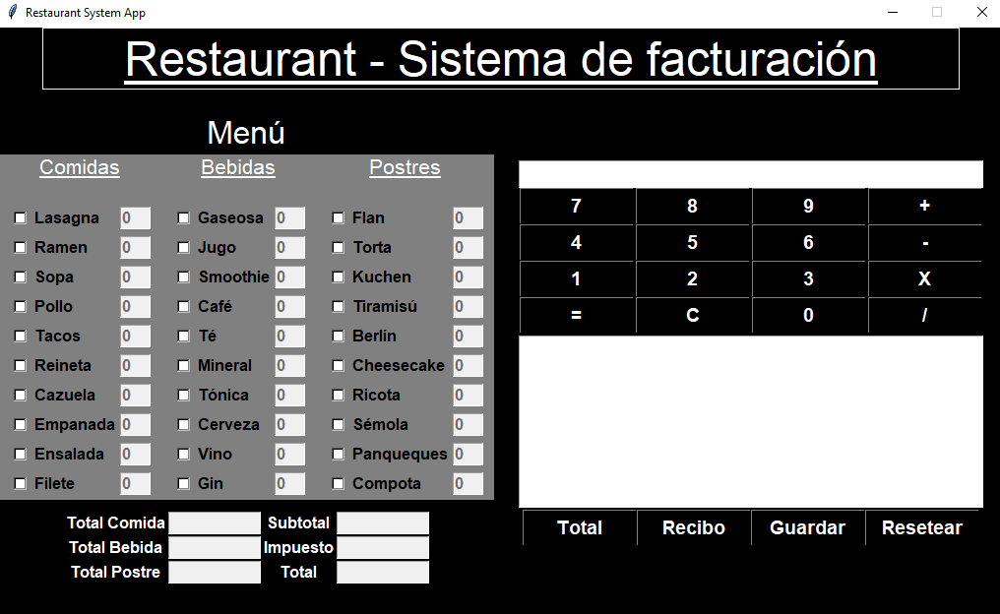
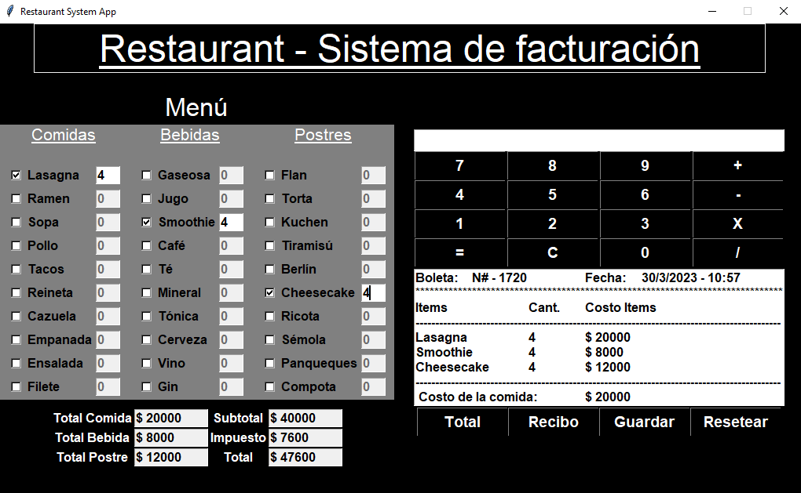

# Aplicación para restaurant en Python
* Permite seleccionar platos y su cantidad
* Calcula totales por tipo de comida e impuestos asociados
* Emite una boleta con numeración y valores
* Se utiliza la libreria TKinter

